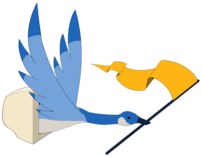

# CSSA CTF 2023 Challenge Repository

    

This repository contains an archive of our source code, resources, docker 
configurations and solutions for all of our CTF 2023 challenges.

## Server Infrastructure

The CTF required a webserver for browsing challenges, registering teams and
tracking scores. Additionally, our challenges consisted of a mix of live service
challenges and local challenges. 

To host all of this, we rented a dedicated server from Nocix with a Ryzen 3800X
and 32GB of RAM. This was overkill! Despite hosting multiple VMs and over 20
Docker containers, we never saw RAM usage exceed 9GB during the competition and 
total CPU usage across all cores never exceeded 10%. Although more cores and RAM,
and fast network speed (Nocix offers 1Gbps standard and real world speed matches)
helped keep things feeling snappy. Our server ran Proxmox VE on baremetal with
two VMs, one for Portainer and one for CTFd. Nocix provides a subnet with 5
host IPs as standard, so we were able to assign public IPs directly to Proxmox,
Portainer and CTFd without the need of a router to delegate ports on a single IP.

We used CTFd as our scoring platform. CTFd is highly configurable and can be
self-hosted (they do offer managed hosting but the price was higher than renting
a dedicated server ourselves). We hooked CTFd up to SMTP2GO as our email service
to send registration verification and password reset emails.

All of our live service challenges used Docker containers. We hosted a private
Docker registry for our images on the rented server and deployed them using 
Portainer. This made challenge deployment relatively straight-forward. We use
Cloudflare as our DNS provider, pointed our wildcard DNS record to our Portainer VM
and used Nginx with Nginx Proxy Manager to reverse proxy any web challenges.

## Challenge Creation

All challenges were created in-house by CSSA members. We used PicoCTF challenges
as inspiration along with our personal experiences, but wanted to make sure
our challenges were our own (and that people couldn't just cheat and google
challenge writeups).

Some of our challenges did not require any live hosted infrastructure beyond
hosting some files for players, such as our cryptography and forensics
challenges. Many of our challenges utilized live hosted Docker containers.
For example, web exploitation challenges hosted Nginx and/or Flask webservers.

For our binary exploitation challenges, we provided source code and binaries
to players, but to ensure players couldn't just find the flag by decompiling
the binary, we hosted the challenges in Docker behind xinetd. xinetd can listen
on a TCP socket which players can connect to with netcat or ncat. When a
player connects, xinetd will launch a process instance of the exploitable binary
and connect the TCP socket to the process stdin/stdout so players can interact
with it similar to SSH. This also means any number of users can connect to
the challenge at once, as xinetd creates a new process instance for every
connection.

# THANK YOU

Thank you to all of our sponsors that made this event possible! We could not
have done it without your support.

